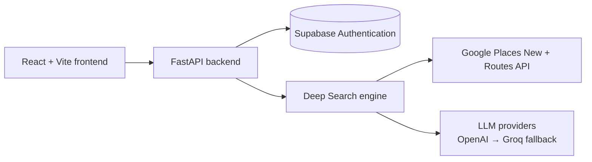

# HomeScout AI

**An AI apartment-search is an agentic tool that assignd apartment search, evaluation and booking tasks to its agents workforce which keep on doing their work for the user in background while keeping the user in the loop.**

HomeScout looks past raw map results. It interprets your stated priorities, figures out what you'd plausibly care about but didn't mention, and evaluates the surrounding amenities at the **right depth** — with travel-based accessibility and traceable, fact-grounded judgments.

> **Project status:**  Rapid & active development in progress. The Deep Search engine's first responsibility (Requirement Interpretation intelligence layer) is built and tested; the search/retrieval of information regarding the quality metrics for attributes of the neighborhood places in under development.

---

## The problem

Deciding whether an apartment's neighborhood works for you is tedious and manual:

- You search for apartmnents options on different websites, at different times, without any option to compare them with each other across platforms.
- You get tired by sending inquiry messages to tens of apartment owners, and finding it hard to keep track of progress with all of them.
- You struggle to analyze apartment in depth to decide if it is even worth inquirying or not.
-  You search for each amenity type one at a time and cross-reference distance yourself — there's **no single view of whether your actual list of priorities is met.**
- A generic search returns **every** "gym" or "park" regardless of whether it has the specific quality you wanted, so you check each one by hand.
- A raw distance number hides whether the route is actually walkable, crosses a highway, or takes far longer in practice than the straight line implies.
- If you forget to ask about a category, you're left blind to it — even when it would have changed your decision.


## What HomeScout does

The product contains 5 features:

1. **Deep Search** ← _current focus_
2. **Deep Analysis**
3. **Matching Engine**
4. **Owners Outreach**
5. **User feedback** 

The **Deep Search** Feature owns to take the user instructions and trigger different agentic workflows for following tasks:

1. Apartment neighborhood quality ← _current focus_
2. Apartment Listings on Web
3. Apartment quality


**Implementation In place for Apartment Neighborhood quality:**
- **Preference-matched amenities** — the categories you named, at full priority, plus a small baseline set you didn't think to mention.
- **Right-depth detail** — more information where you care more, less where you don't, decided per category.
- **Real accessibility** — travel-based route, mode, and time, not straight-line distance.
- **Characteristic matching** — a "quiet café with wifi," or a reasonably close alternative, rather than every café found.
- **Traceable judgments** — an assessment for each amenity, kept structurally separate from the facts it was derived from, so you can see _why_, not just a verdict.

## Status

| Area | Status |
| --- | --- |
| **Deep Search — Responsibility 1: Requirement Interpretation intelligence layer** | ✅ Built |
| **Deep Search — Responsibility 2: Search & Retrieval** | 🚧 80 % (Extraction of In-depth info regarding neighborhood amenities) |
| HTTP API for Deep Search | 📋 To be |
| Frontend integration for Deep Search | 📋 To be |

## How Deep Search works for Neighborhood Quality Analysis

The feature is decomposed into **responsibilities**, each a workflow of **mechanisms** built one at a time. Full specs live in [`backend/src/services/deep_search/feature_context/`](backend/src/services/deep_search/feature_context/).

**Responsibility 1 — Requirement Interpretation intelligence layer** (✅). Turns raw, natural-language requirements into a per-category specification — reason, priority, depth, and metrics — and nothing beyond it. No searching happens here. Pipeline:

- **Extraction** — parse unstructured input into separated buckets: explicit categories, characteristics, ambiguity flags, and persona/lifestyle facts.
- **Category resolution + clarification** — map each stated category to a maintained amenity taxonomy; when a category is ambiguous, ask the user one grounded question and resolve it against their answer.
- **Persona inference** — infer a small number of categories the user didn't state but would plausibly want, kept strictly below their explicit priorities.
- **Depth assignment** — give every category one shared depth level so later stages know how much to fetch.
- **Metric definition** — define the category-appropriate metrics and facts sufficient to judge whether an amenity actually fits.

**Responsibility 2 — Search & Retrieval** (🚧). Consumes R1's specification as its only input. **Place discovery** (Google Places New API) is implemented; travel-based accessibility, deeper retrieval, representative-set narrowing, and traceable assessment are on the [roadmap](#roadmap).

- **Extraction of Google Places Information** — Extracted the pre-defined metrics related to quality of the attributes of the amenities that are discovered in the neighborhood of listing identified/provided by the user.

- **Dynamic Metrics Extraction** — Agents are provided with the tools (Web search / Web extraction) to search for the specific information about the places that are required by the dynamically generated metrics of places so, that user can get analysis of the neighborhood amenities based on things they reall care about and not just on geenric metrics.

## Architecture (As of now)



Monorepo layout:

| Path | What's there |
| --- | --- |
| [`backend/`](backend/) | FastAPI service — the Deep Search engine plus supporting APIs. See [`backend/README.md`](backend/README.md). |
| [`frontend/`](frontend/) | React 19 + Vite single-page app. |
| [`supabase/`](supabase/) | Database migrations / Authentication |
|

## Getting started

**Prerequisites:** Python 3.13, Node.js, Docker (optional), and API keys for OpenAI/Groq and Google Places.

```bash
git clone <repo-url>
cd HomeScout_AI
```

Create each app's environment file from its example and fill in your values:

```bash
cp backend/.env.example backend/.env
cp frontend/.env.example frontend/.env
```

**Backend:**

```bash
cd backend
pip install -r requirements.txt
uvicorn src.app.main:app --port 8000
```

**Frontend:**

```bash
cd frontend
npm install
npm run dev
```

**Or run both with Docker Compose:**

```bash
docker-compose up
```

> Detailed backend setup (local HTTPS, environment reference) is in [`backend/README.md`](backend/README.md).

